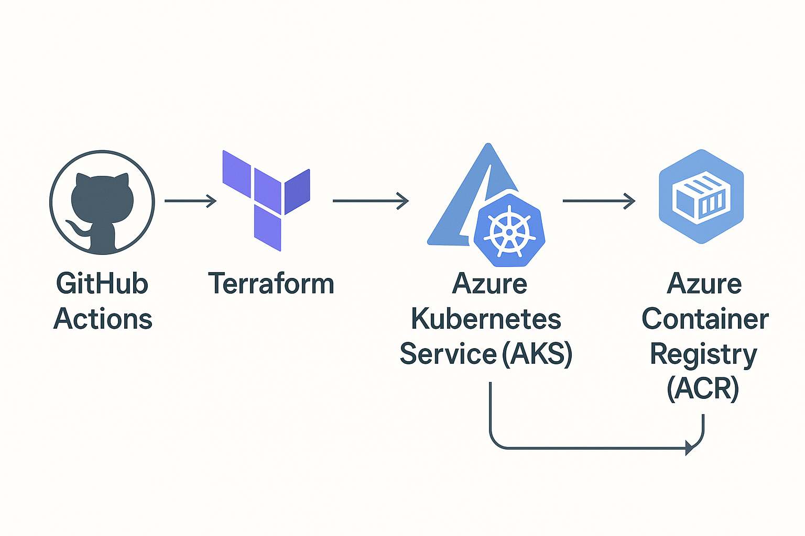

# Scalable E-commerce Backend on AKS

This project deploys a Flask application to Azure Kubernetes Service (AKS) using Terraform for infrastructure provisioning, Azure Container Registry (ACR) for container storage, and GitHub Actions for CI/CD. 

The Flask app in `app/backend/app.py` provides two endpoints:
- `/`: Returns `"Sunny is saying Hi from AKS"`.
- `/products`: Returns a JSON list of PlayStation products.

**The project supports manual deployment (Terraform, Docker, kubectl) and automated deployment (GitHub Actions), serving as a scalable e-commerce backend.**

### **Cloud-Native Deployment Workflow**

This diagram illustrates the CI/CD pipeline using GitHub Actions, Terraform, Azure Kubernetes Service (AKS), and Azure Container Registry (ACR).

### 🧰 **Tech Stack**
- Terraform — Infrastructure as Code
- Azure Kubernetes Service (AKS) — Container Orchestration
- Azure Container Registry (ACR) — Private Docker Registry
- GitHub Actions — CI/CD Pipeline
- Docker — Containerization
- Flask — Lightweight Web Framework (Python)

### **Project Structure**
<details>
<summary>View Layout</summary>

```text
.
├── app
│   ├── backend
│   │   ├── Dockerfile
│   │   └── app.py
│   └── k8s
│       └── deployment.yaml
├── terraform
│   ├── main.tf
│   ├── backend.tf
│   ├── outputs.tf 
│   └── variables.tf
├── .github
│   └── workflows
│       └── deploy.yml
├── README.md
├── .gitignore
└── cloud-native-workflow.png
```
</details>

### ✅**Pre-Requisites**
- Azure account with subscription
- Azure CLI
- Terraform installed
- GitHub account
- Docker installed (for local builds)
- Kubectl installed
- Git
- VS Code (recommended)


**Azure Setup Steps**
- Log in to Azure: `az login`.
- Set up Azure Service Principal
(Recommended for Terraform and GitHub Actions authentication)
`az ad sp create-for-rbac --name "ecommerce-sp" --role="User Access Administrator" --scopes="/subscriptions/<your-subscription-id>"`
Save the output (client ID, client secret, subscription ID, tenant ID) for GitHub secrets.

**Backend Configuration**
This project uses Azure Storage Account for Terraform remote state management.
Since Storage Account names must be globally unique, you have two options:
- Create your own backend:
Create a Storage Account and blob container in Azure.
```text
RESOURCE_GROUP="ecommerce-tfstate-rg"
STORAGE_ACCOUNT="youruniquestorageacctname"
CONTAINER="tfstate"
LOCATION="northeurope"

az group create --name $RESOURCE_GROUP --location $LOCATION
az storage account create --name $STORAGE_ACCOUNT --resource-group $RESOURCE_GROUP --location $LOCATION --sku Standard_LRS
az storage container create --name $CONTAINER --account-name $STORAGE_ACCOUNT
```

Save the storage account name and generate a key:
```bash
STORAGE_KEY=$(az storage account keys list --resource-group $RESOURCE_GROUP --account-name $STORAGE_ACCOUNT --query "[0].value" -o tsv)
```
**OR**
- Use local backend for testing:
`Comment out or remove backend.tf.`
Terraform will default to a local terraform.tfstate file.


### 🔧 **Manual Deployment**
Follow these steps to manually deploy the backend to AKS using Terraform, Docker, and kubectl.

1. **Fork and Clone the Repository**
- Fork this repository to your own GitHub account.
- Then clone it locally:
```bash
git clone https://github.com/<your-username>/ecommerce-project.git
cd ecommerce-project
```

2. **Configure Terraform**
- Update the backend configuration in `terraform/backend.tf` with your own Azure Storage Account details:
```hcl
terraform {
  backend "azurerm" {
    resource_group_name  = "ecommerce-tfstate-rg"
    storage_account_name = "youruniquestorageacctname"
    container_name       = "tfstate"
    key                  = "prod.tfstate"
  }
}
```
Initialize and apply Terraform configuration:
```bash
cd terraform
terraform init -backend-config="access_key=$STORAGE_KEY"
terraform plan
terraform apply -auto-approve
```

3. **Build and Push Docker Image**
```bash
# Login to ACR
az acr login --name ecommerceacr190425

# Build and tag Docker image
docker build -t ecommerceacr190425.azurecr.io/ecommerce-backend:v1 ./app/backend

# Push the image to ACR
docker push ecommerceacr190425.azurecr.io/ecommerce-backend:v1
```

4. **Configure kubectl for AKS**
```bash
az aks get-credentials --resource-group ecommerce-rg --name ecommerce-aks
```

5. **Deploy to AKS**
```bash
kubectl apply -f ./app/k8s/deployment.yaml
```

6. Verify AKS Deployment**
```bash
# Check Pods are running
kubectl get pods

# Check the service
kubectl get svc
```
You should see an external IP under the **EXTERNAL-IP** column for the LoadBalancer service

7. **Test the Endpoints**
```bash
curl http://<EXTERNAL-IP>/
# Output: Sunny is saying Hi from AKS

curl http://<EXTERNAL-IP>/products
# Output: [{"id": 1, "name": "PlayStation 5", "price": 400}, {"id": 2, "name": "PlayStation 5 Pro", "price": 600}]
``` 
Or visit
- `http://<EXTERNAL-IP>/`
- `http://<EXTERNAL-IP>/products`
from your browser

8. **Cleanup:**
```bash
cd terraform
terraform destroy
```

### 🚀 GitHub Actions Deployment
GitHub Actions automates Docker image builds and AKS deployments upon push to the main branch.

1. **Fork the Repository**
If you haven’t already, fork this repository to your own GitHub account to enable GitHub Actions in your context.

2. **Configure Github Secrets**
In your forked repository, navigate to
```sql
Settings → Secrets and variables → Actions → New repository secret
```
Add the following secrets
```markdown 
| Secret Name              | Description (Secret)                           |
|--------------------------|------------------------------------------------|
| AZURE_CLIENT_ID          | Service Principal App ID                       |
| AZURE_CLIENT_SECRET      | Service Principal Password                     |
| AZURE_SUBSCRIPTION_ID    | Azure Subscription ID                          |
| AZURE_TENANT_ID          | Azure Tenant ID                                |
| AZURE_CREDENTIALS        | Full JSON output from az ad sp create-for-rbac |
| ACR_REGISTRY             | ACR name (ecommerceacr190425)                  |
| AZURE_STORAGE_ACCESS_KEY | Storage Account access key (for backend state) |
```

2. **Push Code to Trigger the Workflow**
Any push to the `main` branch will trigger the CI/CD workflow defined in `.github/workflows/deploy.yml`.
```bash
git add .
git commit -m "Update for GitHub Actions deployment"
git push origin main
```
This will:
- Authenticate with Terraform using the credentials defined in the workflow's env section
- Build the Docker image from the backend
- Push the image to ACR
- Authenticate with AKS
- Apply the Kubernetes deployment manifest
You can monitor the workflow under the Actions tab of your GitHub repository.


### ⚠️ Common Issues Encountered
```markdown
| Issue                                  | Fix                                                                 |
|----------------------------------------|---------------------------------------------------------------------|
| Terraform init fails in GitHub Actions | Ensure correct AZURE_STORAGE_ACCESS_KEY secret                      |
| Error 403: Authorization Failed        | Ensure 'User Access Administrator' role is assigned to SP           |
| kubectl get pods not returning         | Make sure correct resource-group and cluster-name are passed in az aks get-credentials|
| Backend State Conflicts                | Create your own backend storage account or use local state if testing|
```


```markdown
## 🙌 Contributing

Contributions are welcome!  
Feel free to fork the repository, make improvements, and submit a pull request.  
Whether it's fixing a bug, improving documentation, or suggesting new features — all contributions are appreciated.

## License

This project is licensed under the MIT License - see the [LICENSE](./LICENSE) file for details.

---

Thank you for exploring this project! ⭐  
If you found it helpful, consider giving it a star or sharing it with others.
```